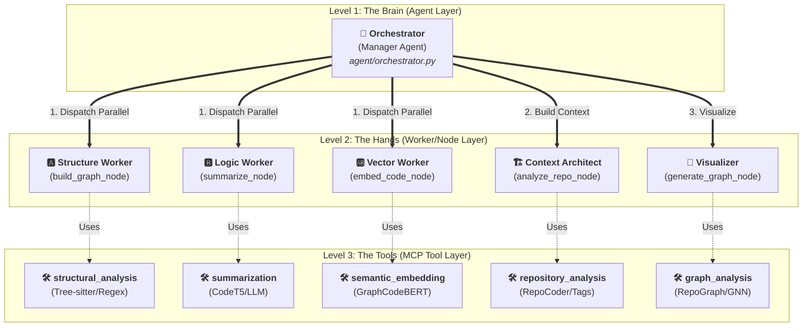
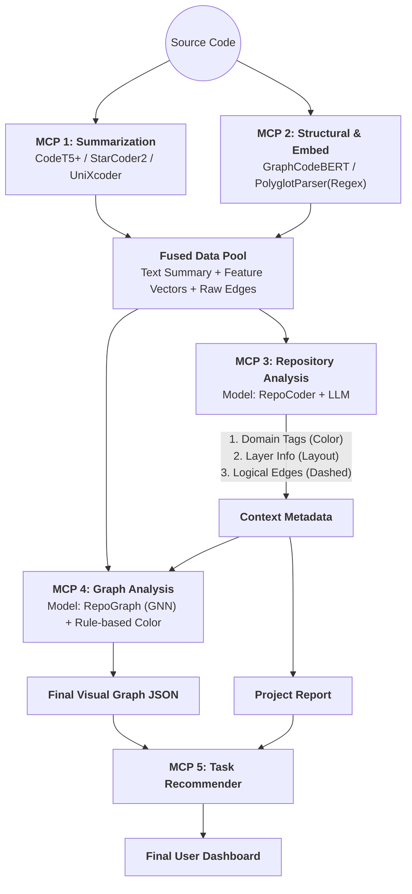
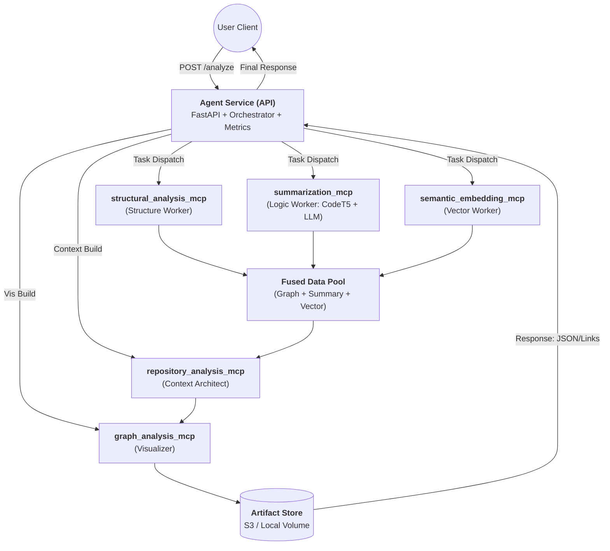

# 📘 Fithub Cognitive Agent: 완전 분석 청사진 (The Blueprint)

> **프로젝트의 모든 진실이 담긴 문서**입니다.
> Fithub 분석 엔진의 **인지적 멀티 에이전트 아키텍처**, **병렬 워크플로우**, 그리고 **3단계 검증 로직**을 상세히 기술합니다.

---

## 1. 🏗️ 상위 아키텍처: "인지적 지휘 체계" (Cognitive Command)
> ✅ **구현 확인 완료:** `agent/nodes.py`, `agent/orchestrator.py`

우리 시스템은 단순한 스크립트가 아닌, **계층형 에이전트 시스템(Hierarchical Agent System)**입니다.

### 🏆 계층 구조 (Hierarchy)
1.  **🎩 지휘자 (Orchestrator - Manager Agent):**
    -   **역할:** "두뇌". 직접 노동하지 않습니다. 관찰하고, 판단하고, 지시합니다.
    -   **지능:** 규칙 기반 휴리스틱 + LLM (GPT-4o)을 활용한 전략적 판단.
    -   **위치:** `agent/orchestrator.py`
2.  **👷 작업자 (Workers - Node Agents):**
    -   **역할:** "손발". 각자 맡은 전문 분야(요약, 구조, 벡터)를 완벽하게 수행합니다.
    -   **지능:** 특화된 SLM (Small Language Models) + 정규식 + AST.
    -   **위치:** `agent/nodes.py`
3.  **🛠️ 전문 도구 (Tools - MCPs):**
    -   **역할:** "장비". 작업자가 꺼내 쓰는 라이브러리입니다.
    -   **위치:** `mcp/*`



---

## 2. ⚡️ 워크플로우: "선 실행, 후 검토" (Run Parallel, Judge Central)
> ✅ **구현 확인 완료:** `agent/workflow.py` (Line 53-60)

파이프라인은 **"병렬로 달리고, 중앙에서 검사한다"**는 철학을 따릅니다.

### Phase 1: 데이터 수집 및 다각도 공격 (Ingest & Multi-Front Attack) ⚔️
-   **Trigger:** 사용자가 Repo URL을 입력함.
-   **Action:** Agent가 3개의 "특수부대"를 동시에 투입합니다.
    1.  **구조팀 (Structure):** `AST`와 `Regex`로 뼈대를 바릅니다.
    2.  **논리팀 (Logic):** `LLM`으로 코드를 읽고 요약합니다.
    3.  **벡터팀 (Vector):** `Embedding Model`로 텍스트를 숫자로 변환합니다.
-   **Tech:** `LangGraph` Async Branches (동시 실행 확인됨).

### Phase 2: 데이터 융합 (Fusion) 🔗
> ✅ **구현 확인 완료:** `agent/fusion.py`
-   **Action:** 3개 팀이 가져온 데이터를 하나로 합칩니다.
-   **Logic:** 파일 ID를 기준으로 구조(AST) + 의미(Summary) + 수치(Vector)를 매핑합니다. Key Mismatch 버그 수정 완료됨.

### Phase 3: 오케스트레이터의 관문 (The Orchestrator's Gate) 👮‍♂️
> ✅ **구현 확인 완료:** `agent/orchestrator.py`
-   **Action:** 지휘자가 융합된 데이터를 검사합니다.
-   **3단계 검증 로직:**
    1.  **빈칸 검사 (Missing Check):** "요약문 비어있는 사람 있어?" -> **부분 재시도(Partial Retry)**.
    2.  **전체 건강검진 (Systemic Check):** "전체 평균 50점 미만이야?" -> **전면 재시도(Full Retry)**.
    3.  **낙제생 선별 (Specific Check):** "너, 너, 너 점수가 왜 이래(0.6 미만)?" -> **선별 재시도(Partial Retry)**.

### Phase 4: 문맥 분석 및 시각화 (Context & Visualization) 🎨
> ✅ **구현 확인 완료:** `agent/nodes.py` (`analyze_repo_node`) & `agent/graph_generator.py`
-   **Action:** 통과된 데이터로 저장소 전체의 계층(Layer)과 태그를 분석하고 그래프를 그립니다.
-   **Analyze Repo Node:** `NetworkX`를 사용하여 연결성(Centrality)과 커뮤니티(Community)를 분석합니다.
-   **Graph Generator:** 프론트엔드용 `nodes`와 `links` 좌표를 계산합니다.

### 📝 데이터 스키마 (JSON Data Schemas)

#### 1. Worker Output (From Summarizer)
```json
{
  "code_id": "auth/login.py",
  "unified_summary": "This file handles JWT authentication...",
  "expert_views": {
    "logic": "Validates token signature...",
    "intent": "Secure user access",
    "structure": "Function: validate_token"
  },
  "quality_score": 0.85
}
```

#### 2. Fused Node (From Fusion)
```json
{
  "id": "auth/login.py",
  "type": "file",
  "summary_text": "This file handles JWT authentication...",
  "embedding": [0.12, 0.05, ...],  // 768-dim vector
  "complexity": 12,
  "label": "login.py"
}
```

#### 3. Final Graph (For Frontend)
```json
{
  "nodes": [
    {"id": "auth/login.py", "group": 1, "val": 10, "label": "login.py", "desc": "Handles JWT..."}
  ],
  "links": [
    {"source": "auth/login.py", "target": "utils/token.py", "value": 5}
  ]
}
```

---

## 3. 🤖 작업자 분대 상세 (The Worker Squads)
> ✅ **구현 확인 완료:** `mcp/*`

### 🅰️ 구조팀: 설계자 (Structure Worker)
-   **목표:** 청사진 그리기 (클래스, 함수, 임포트 관계).
-   **무기:**
    -   **Python:** `ast` 라이브러리 (정확도 100%).
    -   **다국어 (JS/Java/Go 등):** `Polyglot` 정규식 패턴 (`analyzer.py` 확인됨).

### 🅱️ 논리팀: 작가 (Logic Worker)
-   **목표:** 코드가 '무엇'을하고 '왜' 하는지 설명.
-   **무기 (하이브리드 앙상블):**
    -   **논리 전문가:** `CodeT5` (Local). 빠르고 전술적.
    -   **의도 전문가:** `Qwen2.5` (API). 전략적이고 비즈니스 이해도 높음.
    -   **구조 전문가:** `Qwen` + `AST Metadata`.
-   **출력:** `{"unified_summary": "String", "expert_views": {JSON}}` (Hybrid 포맷 확인됨).

### 🆎 벡터팀: 수학자 (Vector Worker)
-   **목표:** 검색을 위한 수치화.
-   **무기:** `Microsoft/graphcodebert-base` (Local).
-   **출력:** 768차원 실수 벡터 (`List[float]`).

### 3️⃣ **Repository Analysis MCP** (Context Provider - The Architect)

- **목표:** **[핵심 연결고리]** 프로젝트 전체를 분석하여, 그래프 생성을 위한 **메타데이터(Tag, Layer, Logical Edge)**를 공급.
- **전략:** RepoCoder로 문맥을 찾고, Mistral-7B/GPT-4o로 태깅하여 Graph MCP에 **"지능"**을 주입.

| 구성 요소 | 사용 모델 | 역할 및 **Graph 기여 포인트** |
| --- | --- | --- |
| **Context Retriever** | **RepoCoder (Vector Sim)** | **[문맥 검색]** 물리적 연결은 없지만 벡터가 유사한(>0.85) 파일 발견. <br>👉 *Graph에 **점선(Implicit Edge)** 추가.* |
| **Topic Tagger** | **Mistral-7B / GPT-4o** | **[도메인 태깅]** 각 파일의 역할(Auth, DB, UI) 분류. <br>👉 *Graph 노드의 **색상(Color)** 결정.* |
| **Arch Detector** | **Rule-based + LLM** | **[계층 판단]** Service / Repository / Controller 구분. <br>👉 *Graph 노드의 **배치(Layout Group)** 결정.* |

- **📥 Input:** `All Summaries` + `All Vectors`
- **📤 Output (Context Metadata):**
    ```json
    {
      "file_metadata": {
        "auth_service.py": {
          "domain_tag": "Security",   // -> Graph MCP: Color 결정용
          "layer": "Service",         // -> Graph MCP: Layout 결정용
          "importance_hint": "High"   // -> Graph MCP: Size 가중치
        }
      },
      "logical_edges": [
        {"source": "auth_service.py", "target": "user_log.py", "type": "logical"}
      ],
      "project_doc": "This project is a Django backend..." // 리포트용 텍스트
    }
    ```

### 4️⃣ **Graph Analysis MCP** (Visualizer - The Builder)

- **목표:** 물리적 정보에 **Repo MCP의 문맥 정보**를 반영하여 **최종 시각화 그래프** 생성.
- **전략:** GNN으로 중요도를 계산하고, Context Metadata로 심미적 요소를 결정.

| 구성 요소 | 사용 기술 | 역할 및 동작 원리 |
| --- | --- | --- |
| **Importance AI** | **RepoGraph (GNN)** | `Vector` + `Raw Edge` + `Importance Hint`를 학습하여 **최종 노드 크기(Size)** 계산. |
| **Color Engine** | **Rule-based Mapping** | `Domain Tag`("Security", "DB" 등)를 사전 정의된 색상표에 매핑. (CuBERT 대체) |
| **Layout Engine** | **NetworkX** | `Layer` 정보를 기반으로 노드 좌표($x, y$) 계산. |

- **📥 Input:** `Fused Vectors` + `Raw Edges` + **`Context Metadata (from MCP 3)`**
- **📤 Output (Final Visual JSON):**
    ```json
    {
      "nodes": [
        {
          "id": "auth_service.py",
          "label": "Auth Service",
          "size": 80,              // GNN 결과 (High Importance)
          "color": "#FF5733",      // 'Security' 태그 색상
          "group": "ServiceLayer", // 레이아웃 그룹
          "summary": "JWT 토큰..."  // 툴팁용
        }
      ],
      "edges": [
        {"source": "auth_service.py", "target": "db_model.py", "style": "solid"}, // Import
        {"source": "auth_service.py", "target": "user_log.py", "style": "dashed"} // Logical
      ]
    }
    ```

### 5️⃣ **Task Recommender MCP** (Action)

- **목표:** 분석된 문맥과 그래프 구조를 기반으로 개선 작업 제안.

| 구성 요소 | 사용 기술 | 역할 |
| --- | --- | --- |
| **Refinement** | **Heuristics** | 복잡도(AST)와 중요도(GNN)가 모두 높은 파일을 찾아 리팩토링 제안. (CodeT5 대체) |
| **Violation Check** | **Heuristics** | "Service Layer가 View Layer를 호출함" 같은 아키텍처 위반 탐지. |

---

## 4. 🧠 인지 기능: "똑똑한" 오케스트레이터
> ✅ **구현 확인 완료:** `agent/orchestrator.py` & `summarizer.py`

단순 반복문이 아닌, **전략가(Strategist)**입니다.

### Feature 1: "지휘관의 시야" (Batch Evaluation)
-   파일 1,000개를 일일이 LLM으로 검사하면 파산합니다.
-   대신 **통계(평균 점수, 최저 점수)**를 보고 판단합니다. 빠르고 효율적입니다.

### Feature 2: "외과 수술식 재시도" (Surgical Retry)
-   **User Request:** "문제 있는 것만 다시 해라."
-   **Logic:** `if score < 0.6: target_files.append(id)`
-   **Result:** 아픈 파일만 정확히 골라내어 치료(재분석)합니다. 멀쩡한 98%는 건드리지 않습니다. (`summarize_repository` 필터링 로직 구현됨)

---

## 5. 📊 데이터 흐름 (Data Flow)

### 🔄 전체 데이터 흐름 (Sequential Context Pipeline)



---

## 6. 🚀 결론 (Conclusion)

이 아키텍처는 Fithub 분석 엔진을 다음과 같이 만듭니다:
1.  **Fast (빠름):** 병렬 실행 (`workflow.py`).
2.  **Smart (똑똑함):** 인지적 판단 및 전략 수정 (`orchestrator.py`).
3.  **Efficient (효율적):** 선별적 재시도 (`Surgical Retry`).

---

## 7. 🏛️ 시스템 구현 아키텍처 (System Implementation Architecture)

> **[Added Version]** 사용자 피드백을 반영하여 구체화된 **Client-Backend 분리 아키텍처**와 **상세 모델 스펙**입니다.

### 7.1. C/S 분리 구조 (Client-Backend Partitioning)

사용자의 요청(Client)에서 시작하여 오케스트레이터(Agent)가 5개의 전문 MCP를 지휘하는 구조입니다.



### 7.2. 역할 분리 (Separation of Concerns)

| **구성 요소** | **역할** |
| --- | --- |
| **Agent Service (API)** | **중앙 관제탑**. 외부 요청을 받고, MCP들을 지휘(Orchestration)하며, 결과를 병합합니다. (`agent/orchestrator.py`) |
| **Orchestrator** | **뇌(Brain)**. 분석 파이프라인의 실행 순서(병렬/재시도/앙상블)를 관리하고 품질 임계치를 판단하여 **지능적 재시도(Surgical Retry)**를 명령합니다. |
| **MCP Tools** | **전문가 집단(Body)**. 각자 독립된 컨테이너에서 코드 구조 추출, 요약, 임베딩, 평가를 수행합니다. |
| **Artifact Store** | **기억 저장소**. 최종 그래프(JSON), 요약(MD), 리포트 등을 저장하고 링크를 제공합니다. |

### 7.3. 상세 MCP 툴 스펙 (Detailed Tool Specs)

#### 1️⃣ structural_analysis_mcp (Structure Worker)
-   **폴더:** `mcp/structural_analysis/`
-   **역할:** 코드 내부의 **구조적 관계(Imports, Calls, Inherits)**를 그래프로 추출.
-   **모델/엔진:** `GraphCodeBERT` (Semantics), `Tree-sitter` (Syntax), `Pyan`(Python AST).
-   **Output:** `CodeGraph(nodes, edges)`.

#### 2️⃣ summarization_mcp (Logic Worker)
-   **폴더:** `mcp/summarization/`
-   **역할:** **하이브리드 요약 (Local + Cloud)**. 빠른 CodeT5 요약과 깊이 있는 LLM 요약을 통합 수행.
-   **모델:** `CodeT5+` (Local), `Qwen2.5/GPT` (LLM).
-   **특징:** 내부적으로 '논리/의도/구조' 3가지 전문가 모드로 동작하여 앙상블 요약 생성.

#### 3️⃣ semantic_embedding_mcp (Vector Worker)
-   **폴더:** `mcp/semantic_embedding/`
-   **역할:** 검색을 위한 수치화.
-   **모델:** `Microsoft/graphcodebert-base`.

#### 4️⃣ metrics (Internal Module)
-   **위치:** `agent/orchestrator.py` & `agent/nodes.py` (Internal Logic)
-   **역할:** MCP가 아닌 **에이전트 내부 로직**으로, 품질을 정량적으로 평가하고 **재시도 루프**를 트리거.
-   **지표:** Cosine Similarity, CodeBLEU.
-   **Action:** 임계치 미달 시 Orchestrator에게 `Refine` 신호 전달.

#### 5️⃣ repository_analysis_mcp (Context Architect)
-   **역할:** 프로젝트 전역 문맥(Context) 형성 및 메타데이터(Domain, Layer) 태깅.
-   **모델:** `RepoCoder` (Search), `Mistral-7B` (Tagging).
-   **Output:** `ContextMetadata` (Color, Group, Implicit Edges).

#### 6️⃣ graph_analysis_mcp (Visualizer)
-   **역할:** 최종 시각화용 노드/엣지 계산.
-   **모델:** `RepoGraph` (GNN for Importance), `NetworkX` (Layout).
-   **Output:** `VisualJSON` (D3.js compatible).

#### 7️⃣ task_recommender_mcp (컨설팅 팀 - Optional)
-   **역할:** "어디부터 고쳐야 하는가?" (Refactoring Hotspot) 제안.
-   **모델:** `Graph Embedding (node2vec)` + `CodeBERT Similarity`.
-   **Output:** 우선순위 태스크 리스트 (e.g., "High Coupling Module Detected").

### 7.4. 모델 간 상호 강화 (Interaction Strategy)

| Source | Target | Interaction Effect |
| :--- | :--- | :--- |
| **LLM Summary** | **Static Graph** | 그래프 노드에 자연어 요약을 메타데이터로 주입 → **"설명 가능한 그래프"** |
| **Static Graph** | **LLM Summary** | 함수 호출 관계를 프롬프트에 제공 → **"문맥을 아는 요약"** |
| **Embedding** | **Metrics** | 벡터 유사도로 요약 품질 검증 (CodeBERT Score) → **"자동 품질 보증"** |
| **RepoGraph** | **Visualizer** | 전역 중요도(PageRank)로 노드 크기 결정 → **"중요한게 크게 보이는 뷰"** |
