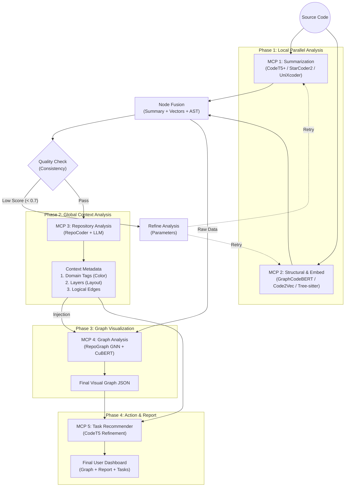

# Fithub 프로젝트 구조

LangGraph 기반 코드 분석 AI 에이전트 - 마이크로서비스 아키텍처

## 전체 코드 구조

```
Fithub (LangGraph 기반 코드 분석 AI 에이전트)
│
├── 🤖 agent/
│   ├── main.py                                     - FastAPI REST API 서버 (포트 8000)
│   ├── workflow.py                                 - LangGraph 워크플로우 정의 및 상태 관리
│   ├── nodes.py                                    - 7개 분석 노드 함수 (요약, 그래프, 임베딩, 분석, 평가, 정제, 종합)
│   ├── edges.py                                    - 노드 간 라우팅 및 조건부 분기 로직
│   ├── state.py                                    - 에이전트 상태 타입 정의 (TypedDict)
│   ├── schemas.py                                  - Pydantic 요청/응답 모델
│   ├── config.py                                   - MCP 엔드포인트 및 환경변수 관리
│   ├── requirements.txt                            - 에이전트 의존성
│   └── Dockerfile                                  - 컨테이너 이미지 빌드
│
├── 🔧 mcp/ (마이크로서비스 5개)
│   ├── summarization/                              - 코드 요약 서비스 (포트 9001, CodeT5+/StarCoder2 모델)
│   ├── structural_analysis/                        - 구조 분석 서비스 (포트 9002, AST/의존성 그래프)
│   ├── semantic_embedding/                         - 의미 임베딩 서비스 (포트 9003, CodeBERT/CuBERT)
│   ├── repository_analysis/                        - 저장소 레벨 분석 (포트 9004, 전체 저장소 처리)
│   └── task_recommender/                           - 작업 추천 서비스 (포트 9005, 리팩토링/개선 제안)
│       (각 MCP는 동일 구조: main.py, analyzer.py, models_loader.py, requirements.txt, Dockerfile)
│
├── 🌐 RESTAPI/ (TypeScript/Node.js)
│   ├── src/                                        - Express 서버 (포트 4000)
│   │   ├── server.ts                               - 메인 Express 앱
│   │   ├── routes/githubRoutes.ts                  - GitHub API 엔드포인트
│   │   ├── middleware/                             - 에러 처리, 입력 검증
│   │   └── github/                                 - GitHub 클라이언트 및 서비스 로직
│   ├── package.json                                - Node.js 의존성 (express, octokit, cors)
│   ├── tsconfig.json                               - TypeScript 컴파일 설정
│   └── dist/                                       - 컴파일된 JavaScript
│
├── 📦 shared/
│   ├── model_utils.py                              - 모델 로딩 및 캐싱 함수
│   ├── ast_utils.py                                - AST 파싱 및 코드 분석 유틸
│   └── git_utils.py                                - Git 저장소 클론/정리 함수
│
├── 🤖 models/ (AI 모델 캐시)
│   ├── summarization/                              - 요약 모델들 (CodeT5+, StarCoder2 등)
│   ├── structural_analysis/                        - 구조 분석 모델 (GraphCodeBERT, CodeBERT)
│   ├── semantic_embedding/                         - 임베딩 모델 (CodeBERT, CuBERT)
│   ├── repository_analysis/                        - 저장소 분석 모델
│   └── task_recommender/                           - 추천 모델
│
├── 📋 .github/
│   ├── ISSUE_TEMPLATE/                             - 9개 이슈 템플릿 (버그, 기능, 배포, 문서 등)
│   └── PULL_REQUEST_TEMPLATE/                      - PR 템플릿
│
├── 🐳 docker-compose.yml                           - 모든 서비스 한 번에 실행 (6개 컨테이너)
├── ⚙️ requirements.txt                             - 메인 프로젝트 의존성
├── 🚀 setup_models.py                              - AI 모델 자동 다운로드 스크립트
├── 📝 .env.example                                 - 환경변수 템플릿
├── 📖 README.md                                    - 프로젝트 메인 문서
├── 📚 model_list.md                                - 사용 가능한 모델 목록
```

---

## 핵심 데이터 흐름

```
사용자 요청
    ↓
[에이전트 (agent/)]
    ├─ summarize_node ──→ summarization MCP (9001)
    ├─ build_graph_node ──→ structural_analysis MCP (9002)
    ├─ embed_code_node ──→ semantic_embedding MCP (9003)
    └─ analyze_repo_node ──→ repository_analysis MCP (9004)
    ↓
[평가 및 정제]
    └─ quality_check → refine 또는 synthesize
    ↓
[최종 결과 + task_recommender MCP (9005)]
```

---

## 주요 특징 및 아키텍처

### 1. 에이전트 워크플로우 (LangGraph)
```
START → [병렬 실행 4개 노드]
         ├─ summarize_node (코드 요약)
         ├─ build_graph_node (구조 분석)
         ├─ embed_code_node (의미 임베딩)
         └─ analyze_repo_node (저장소 분석)
              ↓
         evaluate_node (품질 평가)
              ↓
         check_quality (조건부 분기)
         ├─ Quality OK → synthesize_node → END
         └─ Quality Low → refine_node → [루프 반복]
```

### 2. 마이크로서비스 아키텍처 (MCP)
- **5개 독립적 서비스**: 각각 별도 포트에서 실행
- **FastAPI 기반**: 각 서비스는 FastAPI 앱으로 구현
- **모델 풀**: 각 MCP는 여러 모델을 관리하는 ModelPool 사용
- **Docker 컨테이너화**: 각 서비스별 Dockerfile 제공

### 3. 설정 및 배포
- **Docker Compose**: 모든 서비스 한 번에 실행 (6개 컨테이너)
- **환경변수**: `.env` 파일로 MCP URL, 포트, 모델 경로 관리
- **헬스 체크**: 각 서비스 `/health` 엔드포인트로 상태 모니터링

### 4. 데이터 흐름
- **입력**: GitHub/로컬/ZIP 저장소
- **처리**: 에이전트가 MCP들을 병렬 호출
- **출력**: 요약, 구조 그래프, 임베딩, 저장소 정보, 작업 추천

### 5. 상태 관리
- **AgentState**: TypedDict로 모든 분석 결과 저장
- **노드 로깅**: 각 노드 실행 시간, 상태, 에러 기록
- **메모리 저장소**: `execution_store` 딕셔너리에 결과 캐싱

---

## 설정 파일 요약

| 파일명 | 위치 | 목적 |
|--------|------|------|
| `requirements.txt` (메인) | 루트 | 메인 프로젝트 의존성 |
| `requirements.txt` (각 MCP) | `mcp/*/` | 각 서비스 의존성 |
| `requirements.txt` (agent) | `agent/` | 에이전트 의존성 |
| `package.json` | `RESTAPI/` | Node.js 의존성 |
| `tsconfig.json` | `RESTAPI/` | TypeScript 설정 |
| `docker-compose.yml` | 루트 | 컨테이너 오케스트레이션 |
| `.env.example` | 루트 | 환경변수 템플릿 |
| `Dockerfile` | `agent/`, `mcp/*/` | 각 컨테이너 빌드 |

---

## 서비스 포트 할당

| 서비스명 | 포트 | 설명 |
|---------|------|------|
| RESTAPI (Express) | 4000 | GitHub 통합 REST API |
| Agent (FastAPI) | 8000 | 메인 오케스트레이션 에이전트 |
| Summarization | 9001 | 코드 요약 서비스 |
| Structural Analysis | 9002 | 구조 분석 서비스 |
| Semantic Embedding | 9003 | 의미 임베딩 서비스 |
| Repository Analysis | 9004 | 저장소 분석 서비스 |
| Task Recommender | 9005 | 작업 추천 서비스 |

---

## 테스트 및 문서
- **테스트 파일**: 별도 `tests/` 디렉토리 없음 (필요시 추가 예정)
- **문서**: README.md, YOUR_TODO.md, MODELS_GUIDE.md 등 다수의 마크다운 문서
- **이슈 템플릿**: 9개 (버그, 기능, 배포, 문서, 리팩토링, 설정, 테스트, 작업, 크로스브라우징)

---

## 프로젝트 상태

**실험적 단계**로, 주요 프레임워크는 완성되었으나 AI 모델 통합이 진행 중인 상태입니다.

---

### 🏛️ Final Architecture: Context-Injected Graph Analysis

이 아키텍처의 핵심은 **"선(先) 문맥 파악, 후(後) 구조 시각화"**입니다.
Repo Analysis가 건축가가 되어 **설계도(Context)**를 그리면, Graph Analysis가 엔지니어가 되어 **실제 건물(Visual Graph)**을 짓는 순서입니다.

---

### 1️⃣ **Summarization MCP** (Local Analysis - Text)

- **목표:** 개별 파일의 기능과 의도를 **3가지 관점**에서 분석하여 정확한 요약 생성.
- **전략:** 기능(CodeT5+) + 의도(StarCoder2) + 구조(UniXcoder) 앙상블.

| 구성 요소 | 사용 모델 | 역할 및 분석 관점 |
| --- | --- | --- |
| **Logic Expert** | **CodeT5+** | **[기능]** 입출력 및 핵심 알고리즘 요약 (함수 단위 최강). |
| **Intent Expert** | **StarCoder2** | **[의도]** 비즈니스 로직 및 코드 존재 이유 설명 (자연어 특화). |
| **Structure Expert** | **UniXcoder** | **[구조]** AST 정보를 포함한 구조적 특징 요약. |
| **Integrator** | **Ensemble Logic** | 3개 결과의 유사도 검증(Quality Check) 후 하나로 통합. |
- **📥 Input:** `Source Code (File/Function)`
- **📤 Output:**
    
    ```json
    {
      "code_id": "auth_service.py",
      "unified_summary": "DB 조회를 통한 사용자 인증(CodeT5+) 및 JWT 토큰 발행 함수. 보안 강화를 위해 존재(StarCoder2).",
      "keywords": ["Authentication", "JWT", "Security"],
      "quality_score": 0.95
    }
    
    ```
    

---

### 2️⃣ **Structural & Embedding MCP** (Local Analysis - Vector)


### ✅ 설계 (Actual Implementation)

우리가 작성한 코드(`mcp/structural_analysis/analyzer.py` 등)와 일치하는 정확한 구성입니다.

| 구성 요소 | **사용 모델 / 기술** | 역할 및 분석 관점 | 실제 구현 파일 |
| :--- | :--- | :--- | :--- |
| **Semantic & Flow** | **GraphCodeBERT** (via API) | **[의미/흐름 벡터화]** <br>코드의 의미와 데이터 흐름을 768차원 벡터로 변환합니다. | `mcp/semantic_embedding/embedder.py` |
| **Physical Structure** | **Polyglot Regex Parser** | **[물리적 관계 추출]** <br>정규표현식을 사용하여 함수, 클래스 정의 및 Import 관계(Raw Edges)를 추출합니다. | `mcp/structural_analysis/analyzer.py` |
| **(Optional) Path** | *(GraphCodeBERT 내장)* | 별도의 AST Linearization 없이, GraphCodeBERT가 학습한 구조적 패턴을 활용합니다. | - |

---

### 📤 수정된 Output JSON (Example)

`Structural Analysis`와 `Embedding`의 결과가 합쳐진 **Fusion 단계**의 데이터 예시입니다.

```json
{
  "code_id": "auth_service.py",
  
  # 1. GraphCodeBERT가 만든 의미 벡터 (Semantic)
  "fused_vector": [0.12, -0.55, 0.88, ...], 
  
  # 2. Polyglot Regex Parser가 찾은 물리적 연결 (Structural)
  "raw_edges": [
    {"source": "auth_service.py", "target": "db_model.py", "type": "imports"},
    {"source": "auth_service.py", "target": "auth_service.py::login", "type": "defines"}
  ],
  
  # 3. 파서가 찾은 메타데이터
  "complexity": 15,
  "language": "Python"
}
```

---

### 3️⃣ **Repository Analysis MCP** (Context Provider - The Architect)

- **목표:** **[핵심 연결고리]** 프로젝트 전체를 분석하여, 그래프 생성을 위한 **메타데이터(Tag, Layer, Logical Edge)**를 공급.
- **전략:** RepoCoder로 문맥을 찾고, LLM으로 태깅하여 Graph MCP에 **"지능"**을 주입.

| 구성 요소 | 사용 모델 | 역할 및 **Graph 기여 포인트** |
| --- | --- | --- |
| **Context Retriever** | **RepoCoder** | **[문맥 검색]** 물리적 연결은 없지만 논리적으로 연결된 파일 발견. <br>👉 *Graph에 **점선(Implicit Edge)** 추가.* |
| **Topic Tagger** | **LLM (Few-shot)** | **[도메인 태깅]** 각 파일의 역할(Auth, DB, UI) 분류. <br>👉 *Graph 노드의 **색상(Color)** 결정.* |
| **Arch Detector** | **Rule-based** | **[계층 판단]** Service / Repository / Controller 구분. <br>👉 *Graph 노드의 **배치(Layout Group)** 결정.* |
- **📥 Input:** `All Summaries` + `All Vectors`
- **📤 Output (Context Metadata):**
    
    ```json
    {
      "file_metadata": {
        "auth_service.py": {
          "domain_tag": "Security",   // -> Graph MCP: Color 결정용
          "layer": "Service",         // -> Graph MCP: Layout 결정용
          "importance_hint": "High"   // -> Graph MCP: Size 가중치
        }
      },
      "logical_edges": [
        {"source": "auth_service.py", "target": "user_log.py", "type": "logical"}
      ],
      "project_doc": "This project is a Django backend..." // 리포트용 텍스트
    }
    
    ```
    

---

### 4️⃣ **Graph Analysis MCP** (Visualizer - The Builder)

- **목표:** 물리적 정보에 **Repo MCP의 문맥 정보**를 반영하여 **최종 시각화 그래프** 생성.
- **전략:** GNN으로 중요도를 계산하고, Context Metadata로 심미적 요소를 결정.

| 구성 요소 | 사용 모델 | 역할 및 동작 원리 |
| --- | --- | --- |
| **Importance AI** | **RepoGraph (GNN)** | `Vector` + `Raw Edge` + `Importance Hint`를 학습하여 **최종 노드 크기(Size)** 계산. |
| **Cluster Engine** | **CuBERT + Tagging** | 벡터 유사도와 `Domain Tag`를 결합하여 **최종 노드 색상(Color)** 및 군집 결정. |
| **Layout Engine** | **NetworkX** | `Layer` 정보를 기반으로 노드 좌표($x, y$) 계산. |
| **Pattern Engine** | **Code2Vec** | **[New]** AST 경로를 분석하여 코드의 **구조적 원형(Archetype)** 분류. <br>👉 **최종 노드 모양(Shape/Icon)** 결정. |

- **📥 Input:** `Fused Vectors` + `Raw Edges` + **`Context Metadata (from MCP 3)`**
- **📤 Output (Final Visual JSON):**
    
    ```json
    {
      "nodes": [
        {
          "id": "auth_service.py",
          "label": "Auth Service",
          "size": 80,              // GNN 결과 (High Importance)
          "color": "#FF5733",      // 'Security' 태그 색상
          "group": "ServiceLayer", // 레이아웃 그룹
          "summary": "JWT 토큰..."  // 툴팁용
        }
      ],
      "edges": [
        {"source": "auth_service.py", "target": "db_model.py", "style": "solid"}, // Import
        {"source": "auth_service.py", "target": "user_log.py", "style": "dashed"} // Logical
      ]
    }
    
    ```
    

---

### 5️⃣ **Task Recommender MCP** (Action)

- **목표:** 분석된 문맥과 그래프 구조를 기반으로 개선 작업 제안.

| 구성 요소 | 사용 모델 | 역할 |
| --- | --- | --- |
| **Refinement** | **CodeT5** | 문제 코드를 입력받아 수정된 코드 생성. |
| **Violation Check** | **Heuristics** | "Service Layer가 View Layer를 호출함" 같은 아키텍처 위반 탐지. |

---

### 🔄 전체 데이터 흐름 (Sequential Context Pipeline)



---

### 💡 최종 아키텍처의 강점 요약

1. **Context-Driven Visualization:**
    - 그래프의 **색상(Color)**과 **위치(Layout)**가 무작위가 아니라, Repo Analysis가 분석한 **"도메인(보안, 결제 등)"**과 **"계층(서비스, DB 등)"**에 따라 결정됩니다.
2. **RepoCoder & RepoGraph의 완벽한 조화:**
    - **RepoCoder**는 보이지 않는 **논리적 연결**을 찾아내고,
    - **RepoGraph**는 그 연결 위에서 **수학적 중요도**를 계산합니다.
3. **명확한 역할 분담:**
    - Repo MCP는 **"이해"**를 담당하고, Graph MCP는 **"표현"**을 담당하여 파이프라인 관리가 용이합니다.

네, **첫 번째 다이어그램의 깔끔한 스타일(평가 루프 포함)**을 유지하면서, **두 번째 다이어그램의 구체적인 모델 구성과 Context-First(Repo → Graph) 흐름**을 완벽하게 결합한 최종 플로우 차트입니다.

### 🏛️ 최종 통합 아키텍처: Context-First AI Agent Pipeline



---

### 🔎 다이어그램 해석 및 핵심 포인트

1. **Phase 1 (병렬 분석 & 평가 루프):**
    - 첫 번째 그림의 스타일대로 `MCP 1`과 `MCP 2`가 병렬로 돌고, `Fusion` 후에 `Evaluate(품질 평가)`를 거칩니다.
    - **Loop:** 만약 점수가 낮으면 `Refine`을 통해 다시 Phase 1으로 돌아갑니다.
2. **Phase 2 (Repo Analysis - The Architect):**
    - 품질 평가를 통과한 데이터는 바로 그래프를 그리지 않고, **Repo Analysis MCP**로 들어갑니다.
    - 여기서 **RepoCoder**와 **LLM**이 "이 파일은 보안 모듈이고, 저 파일과 논리적으로 연결됨"이라는 **Context Metadata**를 생성합니다.
3. **Phase 3 (Graph Analysis - The Visualizer):**
    - **핵심:** `Fusion`된 원천 데이터와 `Context Metadata`가 **MCP 4 (Graph Analysis)**에서 만납니다.
    - *RepoGraph(GNN)**와 **CuBERT**가 문맥 정보를 반영하여 **"의미 있는 색상과 배치를 가진 그래프"**를 생성합니다.
4. **Phase 4 (최종):**
    - 모든 정보가 **Task Recommender**로 모여 최종 대시보드에 뿌려집니다.
