### 🏛️ Final Architecture: Context-Injected Graph Analysis

이 아키텍처의 핵심은 **"선(先) 문맥 파악, 후(後) 구조 시각화"**입니다.
Repo Analysis가 건축가가 되어 **설계도(Context)**를 그리면, Graph Analysis가 엔지니어가 되어 **실제 건물(Visual Graph)**을 짓는 순서입니다.

---

### 1️⃣ **Summarization MCP** (Hybrid Analysis: Local CodeT5 + Cloud Qwen)

- **목표:** 개별 파일의 기능과 의도를 **3가지 관점**에서 분석하여 정확한 요약 생성.
- **전략:** **Hybrid Strategy** (속도와 지능의 조화).

| 구성 요소 | 사용 모델 | 역할 및 분석 관점 |
| --- | --- | --- |
| **Logic Expert** | **Local CodeT5** | **[기능]** 입출력 및 핵심 알고리즘 요약. (0.2초 초고속) |
| **Intent Expert** | **Qwen 2.5 API** | **[의도]** 비즈니스 로직 및 코드 존재 이유 설명. (Role-Based Prompting) |
| **Structure Expert** | **Qwen 2.5 API** | **[구조]** **AST 메타데이터(복잡도, 임포트)**를 참고한 구조적 특징 요약. |
| **Integrator** | **Ensemble Logic** | 3개 결과의 유사도 검증(Quality Check) 후 하나로 통합. |

- **📥 Input:** `Source Code (File/Function)`
- **📤 Output:**
    ```json
    {
      "code_id": "auth_service.py",
      "unified_summary": "사용자 인증 로직(CodeT5) 및 보안 세션 관리(Qwen). Singleton 패턴 적용(Qwen+AST).",
      "summary_details": { // [New] 상세 분석 결과 보존
          "logic": "Validates credentials...",
          "intent": "Critical security component...",
          "structure": "Service layer implementation..."
      },
      "quality_score": 0.95
    }
    ```

---

### 2️⃣ **Structural & Embedding MCP** (Local Analysis - Vector)

- **목표:** 코드를 단순 숫자가 아닌 **흐름과 경로가 담긴 고차원 벡터**로 변환하고, 물리적 구조를 파악.

| 구성 요소 | 사용 기술 | 역할 및 분석 관점 |
| --- | --- | --- |
| **Data Flow** | **GraphCodeBERT** | **[변수 흐름]** 변수의 정의-사용(Use-Def) 관계 벡터화. (Code2Vec 대체) |
| **Raw Parser** | **PythonASTAnalyzer / PolyglotParser** | **[물리적 관계]** AST(Python) 및 정규식(Others)으로 Import, Class, Function 정의 추출. |

- **📥 Input:** `Source Code`
- **📤 Output:**
    ```json
    {
      "code_id": "auth_service.py",
      "fused_vector": [0.12, -0.55, ...], // (GraphCodeBERT 벡터)
      "raw_edges": [{"target": "db_model.py", "type": "import"}]
    }
    ```

---

### 3️⃣ **Repository Analysis MCP** (Context Provider - The Architect)

- **목표:** **[핵심 연결고리]** 프로젝트 전체를 분석하여, 그래프 생성을 위한 **메타데이터(Tag, Layer, Logical Edge)**를 공급.
- **전략:** RepoCoder로 문맥을 찾고, Mistral-7B/GPT-4o로 태깅하여 Graph MCP에 **"지능"**을 주입.

| 구성 요소 | 사용 모델 | 역할 및 **Graph 기여 포인트** |
| --- | --- | --- |
| **Context Retriever** | **RepoCoder (Vector Sim)** | **[문맥 검색]** 물리적 연결은 없지만 벡터가 유사한(>0.85) 파일 발견. <br>👉 *Graph에 **점선(Implicit Edge)** 추가.* |
| **Topic Tagger** | **Mistral-7B / GPT-4o** | **[도메인 태깅]** 각 파일의 역할(Auth, DB, UI) 분류. <br>👉 *Graph 노드의 **색상(Color)** 결정.* |
| **Arch Detector** | **Rule-based + LLM** | **[계층 판단]** Service / Repository / Controller 구분. <br>👉 *Graph 노드의 **배치(Layout Group)** 결정.* |

- **📥 Input:** `All Summaries` + `All Vectors`
- **📤 Output (Context Metadata):**
    ```json
    {
      "file_metadata": {
        "auth_service.py": {
          "domain_tag": "Security",   // -> Graph MCP: Color 결정용
          "layer": "Service",         // -> Graph MCP: Layout 결정용
          "importance_hint": "High"   // -> Graph MCP: Size 가중치
        }
      },
      "logical_edges": [
        {"source": "auth_service.py", "target": "user_log.py", "type": "logical"}
      ],
      "project_doc": "This project is a Django backend..." // 리포트용 텍스트
    }
    ```

---

### 4️⃣ **Graph Analysis MCP** (Visualizer - The Builder)

- **목표:** 물리적 정보에 **Repo MCP의 문맥 정보**를 반영하여 **최종 시각화 그래프** 생성.
- **전략:** GNN으로 중요도를 계산하고, Context Metadata로 심미적 요소를 결정.

| 구성 요소 | 사용 기술 | 역할 및 동작 원리 |
| --- | --- | --- |
| **Importance AI** | **RepoGraph (GNN)** | `Vector` + `Raw Edge` + `Importance Hint`를 학습하여 **최종 노드 크기(Size)** 계산. |
| **Color Engine** | **Rule-based Mapping** | `Domain Tag`("Security", "DB" 등)를 사전 정의된 색상표에 매핑. (CuBERT 대체) |
| **Layout Engine** | **NetworkX** | `Layer` 정보를 기반으로 노드 좌표($x, y$) 계산. |

- **📥 Input:** `Fused Vectors` + `Raw Edges` + **`Context Metadata (from MCP 3)`**
- **📤 Output (Final Visual JSON):**
    ```json
    {
      "nodes": [
        {
          "id": "auth_service.py",
          "label": "Auth Service",
          "size": 80,              // GNN 결과 (High Importance)
          "color": "#FF5733",      // 'Security' 태그 색상
          "group": "ServiceLayer", // 레이아웃 그룹
          "summary": "JWT 토큰..."  // 툴팁용
        }
      ],
      "edges": [
        {"source": "auth_service.py", "target": "db_model.py", "style": "solid"}, // Import
        {"source": "auth_service.py", "target": "user_log.py", "style": "dashed"} // Logical
      ]
    }
    ```

---

### 5️⃣ **Task Recommender MCP** (Action)

- **목표:** 분석된 문맥과 그래프 구조를 기반으로 개선 작업 제안.

| 구성 요소 | 사용 기술 | 역할 |
| --- | --- | --- |
| **Refinement** | **Heuristics** | 복잡도(AST)와 중요도(GNN)가 모두 높은 파일을 찾아 리팩토링 제안. (CodeT5 대체) |
| **Violation Check** | **Heuristics** | "Service Layer가 View Layer를 호출함" 같은 아키텍처 위반 탐지. |

---

### 🔄 전체 데이터 흐름 (Sequential Context Pipeline)

